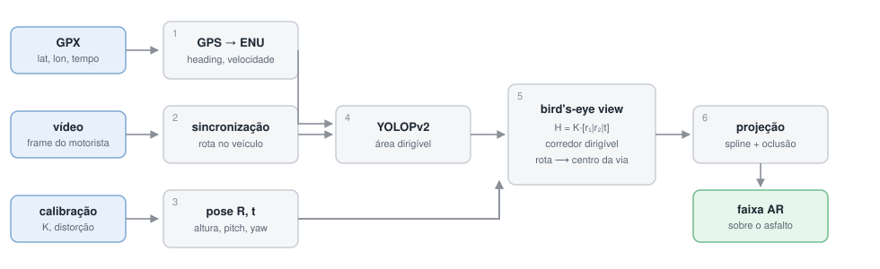

# Navegação AR urbana — projeção de rota GPS sobre a imagem do motorista

Protótipo do PIBIC 26/27. Dada uma rota gravada por GPS, os parâmetros de
calibração da câmera e a segmentação da via por uma rede neural, o sistema
desenha o trajeto futuro **sobre o asfalto**, na perspectiva do motorista.



## Ideia

O trajeto vem do GPS; o asfalto visível vem da câmera. Cada um sozinho é
insuficiente — o GPS de celular erra alguns metros (a rota "sobe na calçada")
e a câmera não sabe para onde o carro vai. A premissa do projeto é que **o
espaço de rua visível faz parte do trajeto GPS**, então as duas fontes são
conciliadas numa vista superior métrica (bird's-eye view), onde a rota é
empurrada para dentro do corredor dirigível antes de voltar para a imagem.

## Pipeline

| # | Módulo | Arquivo | Entrada → Saída |
|---|--------|---------|-----------------|
| 1 | GPS | `modulos/gps.py` | GPX → ENU, heading recalculado, velocidade |
| 2 | Sincronização | `modulos/video.py`, `sync.py` | frame ↔ posição; rota futura no referencial do veículo |
| 3 | Calibração | `modulos/calibration.py` | `K`, distorção, pose da câmera (`R`, `t`) |
| 4 | Segmentação | `modulos/segmentation.py` | frame → área dirigível, faixas, obstáculos (YOLOPv2) |
| 5 | IPM / BEV | `modulos/ipm.py` | homografia do solo, corredor dirigível, ajuste da rota |
| 6 | Projeção e render | `modulos/projection.py`, `render.py` | rota → pixels, oclusão, faixa AR |
| 7 | Orquestração | `modulos/pipeline.py` | tudo acima, num comando |

### A matemática, em quatro passos

**1. Esférico → cartesiano local.** As coordenadas do GPX passam por ECEF e
chegam ao plano tangente local (ENU), onde a geometria projetiva é linear.
A rota é então reescrita no referencial do veículo:

```
X =  Δe·sin(h) + Δn·cos(h)        (frente)
Y = -Δe·cos(h) + Δn·sin(h)        (esquerda)
```

**2. Mundo → câmera (extrínsecos).** `X_C = R·X_W + t`, com
`R = Rz(roll)·Rx(-pitch)·Ry(yaw)·R_base` e `t = -R·(0,0,h)ᵀ`.

**3. Câmera → pixels (intrínsecos).** `ỹ = K·X_C`, seguido da divisão pela
profundidade: `u = ỹ₀/ỹ₂`, `v = ỹ₁/ỹ₂`.

**4. Suavização, oclusão e recorte.** Spline cúbica no plano métrico, corte
por profundidade negativa, por área não dirigível e por obstáculos detectados.

### O "truque" da bird's-eye view

Para pontos do solo (`Z = 0`) a projeção colapsa numa homografia
`H = K·[r₁|r₂|t]`. Invertê-la produz a vista superior. Nela:

1. mede-se o **corredor dirigível** linha a linha (largura e centro em metros);
2. a rota do GPS é atraída ao centro do corredor (`peso_centro`) e confinada
   a uma margem das bordas;
3. o ajuste de curva acontece num espaço euclidiano, então a suavização não
   fica deformada pela perspectiva;
4. a curva volta para a imagem pela mesma homografia.

## Instalação

```bash
git clone --recurse-submodules https://github.com/pedro-acviana/-urban-ar-nav-yolo.git
cd -urban-ar-nav-yolo
pip install -r requirements.txt
```

Se já tiver clonado sem os submódulos:

```bash
git submodule update --init --recursive
```

### Insumos não versionados

Os arquivos abaixo ficam fora do Git por tamanho e precisam ser obtidos
separadamente:

| Arquivo | Como obter |
|---|---|
| `YOLOPv2/data/weights/yolopv2.pt` | [release oficial](https://github.com/CAIC-AD/YOLOPv2/releases/download/V0.0.1/yolopv2.pt) (~156 MB) |
| `data/*.mp4` | vídeos gravados em campo |
| `camera_calibration/imagens_calibracao/` | fotos do tabuleiro de xadrez |

Os `.gpx` e o `calibracao_camera.json` **estão** versionados.

## Uso

```bash
jupyter lab notebooks/workflow_prototipo.ipynb
```

Ou direto em Python:

```python
from modulos.config import Config
from modulos import pipeline

cfg = Config(nome_percurso="volta_menor", frame_alvo=692,
             offset_sync_s=-4.0, altura_camera_m=1.50, pitch_deg=-10.0)

resultado = pipeline.executar(cfg)
resultado.salvar()
```

## Calibrando a pose da câmera

`K` e os coeficientes de distorção vêm do tabuleiro de xadrez, mas os
`rvec`/`tvec` daquele JSON descrevem a pose de cada **tabuleiro**, não a da
câmera dentro do carro. Altura, pitch, yaw e roll são parâmetros manuais.

Para acertá-los, a seção 3 do notebook projeta uma grade métrica sobre o
frame — basta ajustar até as linhas assentarem no asfalto. Dois atalhos:

```python
# o horizonte depende só do pitch
cal.pitch_pelo_horizonte(intr, v_horizonte=780)

# um ponto no asfalto de distância conhecida dá a altura
cal.altura_por_referencia(intr, pitch_deg=0.0, v=1350, distancia_m=8.0)
```

## Estrutura

```
modulos/          pacote com as etapas do pipeline
notebooks/        workflow_prototipo.ipynb (+ legado/)
data/             .gpx, .kml versionados; .mp4 ignorados
camera_calibration/  calibracao_camera.json + script de calibração
docs/             plano e diagramas
YOLOPv2/          submódulo — segmentação de via
HybridNets/       submódulo — alternativa ao YOLOPv2
deepdrive/        submódulo — simulador
sumo/             submódulo — simulação de tráfego
Autonomous-Car-Simulation-with-Genetic-Algorithm/   submódulo
```

## Limitações

1. **Pose manual** — altura e pitch são ajustados a olho. Próximo passo:
   estimar pitch/roll pelo ponto de fuga das faixas.
2. **Solo plano** — a IPM assume `Z = 0`; em ladeira o erro cresce com a
   distância.
3. **Sincronização por offset constante**, sem correção de deriva.
4. **Calibração com fotos**, cuja proporção difere levemente da do vídeo:
   `fx` e `fy` recebem fatores de escala distintos. Recalibrar gravando vídeo
   elimina a aproximação.
5. **Um frame por vez**, sem filtro temporal.

## Referências

- [YOLOPv2](https://github.com/CAIC-AD/YOLOPv2) — Han et al., 2022
- [HybridNets](https://github.com/datvuthanh/HybridNets) — Vu et al., 2022
- Artigo base da arquitetura GAN-LSTM: *Sensors* 25(3), 820
